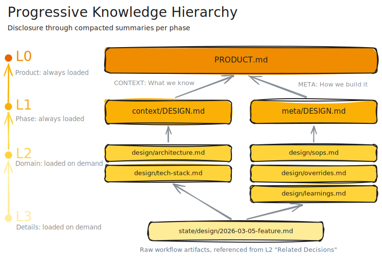
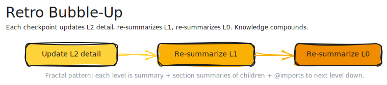

Turns Claude Code into a disciplined engineering partner. Five phases. Context that compounds. Patterns that stick.

```
/design → /plan → /implement → /validate → /release
```

## The Problem

Every AI coding session starts from scratch. You re-explain your architecture. Re-state your conventions. Re-describe decisions you made three sessions ago. The agent forgets everything between context windows, so you become the memory.

This works for quick fixes. It falls apart for anything that spans sessions.

## Install

### Requirements

| Prerequisite | Why |
|---|---|
| macOS | Only supported platform |
| [Node.js](https://nodejs.org/) >= 18 | Runtime for npx |
| [Claude Code](https://docs.anthropic.com/en/docs/claude-code) | AI coding assistant |
| [Git](https://git-scm.com/) | Worktree operations |
| [iTerm2](https://iterm2.com/) | Pipeline orchestration |
| [GitHub CLI](https://cli.github.com/) *(optional)* | Issue and project board sync |

### One-Liner

```bash
npx beastmode install
```

Installs the plugin, CLI, and all dependencies. Re-run to update.

### Uninstall

```bash
npx beastmode uninstall
```

Removes the plugin and CLI link. Project data in `.beastmode/` is preserved.

Initialize your project:

```bash
/beastmode init
```

Init detects your stack and bootstraps the full knowledge hierarchy — inventory, context writing, retro, and synthesis. Existing projects get 17 detected domains populated from your codebase. New projects get the skeleton and a nudge toward `/design`.

## The Pipeline

| Phase | Skill | What Happens |
|-------|-------|-------------|
| Design | `/design` | Structured dialogue. Research from 3+ sources. Lock decisions before writing code. |
| Plan | `/plan` | Break the design into wave-ordered, file-isolated tasks. Generate integration tests. |
| Implement | `/implement` | Fan out one agent per feature in parallel worktrees. Two-stage review per task. |
| Validate | `/validate` | Tests, lint, type checks. Failing features regress to implement automatically. |
| Release | `/release` | Changelog, version bump, retro, squash-merge to main. |

**Quick fix?** Jump straight to `/implement`.
**New feature?** Start at `/design`. Each phase writes artifacts to `.beastmode/`. The next session picks up where you left off.

## Three Ideas

### 1. Context That Survives

Most AI coding tools are stateless. The ones that try to fix this embed everything into a vector space and hope similarity search returns the right chunks.

Beastmode takes a different approach. Project knowledge lives in a four-level hierarchy — curated summaries, not embeddings. Agents navigate from high-level overviews down to specific details. Deterministic paths through a known structure, not probabilistic retrieval.

```
L0  BEASTMODE.md          ← always loaded (~40 lines)
L1  context/DESIGN.md     ← loaded at phase start
L2  context/design/arch…  ← loaded on demand
L3  artifacts/design/…    ← linked from L2
```

No vector database. No embeddings to regenerate. Markdown files in git. A compaction agent prunes stale records, folds restatements, and promotes cross-phase patterns upward — run it with `beastmode compact` whenever the tree needs trimming.



[Why this works better than embeddings.](docs/progressive-hierarchy.md)

### 2. A System That Learns

Every release ends with a retro. Two agents review what happened across all phases: one checks published knowledge for drift, the other extracts operational insights.

Single observations start at low confidence. When the same pattern recurs across sessions, confidence rises. Recurring patterns promote to procedures that load automatically.

```
Session 3: "snake_case for DB columns"  → recorded
Session 5: same finding                 → recurring
Session 7: same finding                 → promoted to procedure
```

The agent stops re-discovering your conventions. The hierarchy gets sharper with every release.



[How the retro loop compounds knowledge.](docs/retro-loop.md)

### 3. Progressive Autonomy

Two modes — manual or autonomous — is a false choice. Trust is granular.

Beastmode places human-in-the-loop gates at every phase. Start supervised everywhere. As trust builds, flip individual phases to autonomous:

```yaml
# .beastmode/config.yaml
hitl:
  design: "always defer to human"                            # you approve designs
  plan: "auto-answer all questions, never defer to human"    # agent plans alone
  implement: "auto-answer all questions, never defer to human"
  validate: "auto-answer all questions, never defer to human"
  release: "always defer to human"                           # you approve releases
```

Same workflow, different trust level. The retro loop is what makes this credible — you flip gates because the agent has demonstrated it learned your patterns. Every HITL decision is logged. At release, retro analyzes your patterns and generates ready-to-paste config snippets for questions you always answer the same way.

File write permissions work the same way — category-based prose rules that control which files the agent can modify without asking:

```yaml
file-permissions:
  claude-settings: "allow read, write to ./skill ./agent ./hooks"
```

## How It Works

Each phase follows four steps:

```
prime → execute → validate → checkpoint
```

**Prime** loads context from `.beastmode/`. **Execute** does the work. **Validate** checks quality. **Checkpoint** saves artifacts. The session ends. The next phase starts clean — fresh context, no leftover state, just artifacts.

Three domains organize what gets persisted:

| Domain | Contents |
|--------|----------|
| **Artifacts** | Skill outputs — design specs, plans, validation records, release notes |
| **Context** | Project knowledge — architecture, conventions, product vision |
| **Research** | Research artifacts — competitive analyses, technology research, reference material |

## The CLI

Skills handle the work inside each phase. The `beastmode` CLI handles everything around it.

```
beastmode <phase> <slug>     # run a single phase
beastmode dashboard          # fullscreen pipeline monitor + orchestrator
beastmode cancel <slug>      # clean up a feature (worktree, branch, tags, artifacts, GitHub issue)
beastmode compact            # prune and promote the context tree
```

### Dashboard

`beastmode dashboard` is both the monitor and the orchestrator. It scans for epics that have a design but no release, and drives them through plan → implement → validate → release automatically.

- Fullscreen terminal UI with epic list, detail panel, and live log stream
- Dispatches one terminal session per phase, one per feature during implement
- Keyboard navigation, phase and status filters, inline cancel with confirmation
- Color-coded phase badges, animated header, verbosity cycling

### Orchestration

The pipeline is a state machine. Each epic tracks its phase, features, and artifacts in a manifest file. The CLI owns the full lifecycle:

- **Worktrees** — created at first phase, persisted through all phases, squash-merged and removed at release. Branch detection reuses `feature/<slug>` if it exists.
- **Parallel implement** — one agent per feature in isolated worktrees. After all agents finish, worktrees merge sequentially with pre-merge conflict simulation. Manifest verified for completeness.
- **Phase regression** — validation failures regress specific failing features back to implement with a dispatch budget. Blanket regression available as fallback. Phase tags mark reset points.
- **Recovery** — manifests are the recovery point. On startup, existing worktrees with uncommitted changes are detected and re-dispatched from last committed state.

### GitHub Integration

When `github.enabled: true` in config, the CLI mirrors pipeline state to GitHub:

- **Epic and feature issues** — created automatically, updated after each phase
- **Labels as source of truth** — phase, type, and status labels drive the state model
- **Project board sync** — issues appear on a GitHub Projects V2 board
- **Commit refs** — phase checkpoints and release merges annotate commit messages with issue numbers

## The Persona

Beastmode has a voice. Deadpan minimalist, slightly annoyed, deeply competent. Says the quiet part out loud. Complains about the work while doing it flawlessly.

This isn't decoration. Consistent tone across long sessions affects how you interact with the tool — and how much you trust it. The persona loads from `BEASTMODE.md` and survives context compaction.

## Where It Fits


Every layer of software delivery has tooling — except where engineers write code. Portfolio has Jira. Delivery has CI/CD. Operations has Datadog.

The Development layer — where a feature becomes a design, a design becomes a plan, and a plan becomes validated code — is manual. Developers carry the workflow in their heads.

Beastmode fills that gap.

```
Feature → Design → Plan → Implement → Validate → Story
```

## What It's Not

- **Not portfolio strategy.** Doesn't decide what to build.
- **Not CI/CD.** Doesn't deploy, monitor, or roll back.
- **Not project management.** No sprints. No velocity charts. One feature, start to finish.

## Credits

Inspired by [superpowers](https://github.com/obra/superpowers) and [get-shit-done](https://github.com/gsd-build/get-shit-done). Beastmode adds persistent context, self-improving retros, and progressive autonomy.

See the full [Changelog](CHANGELOG.md) and [Roadmap](ROADMAP.md).

## License

MIT
