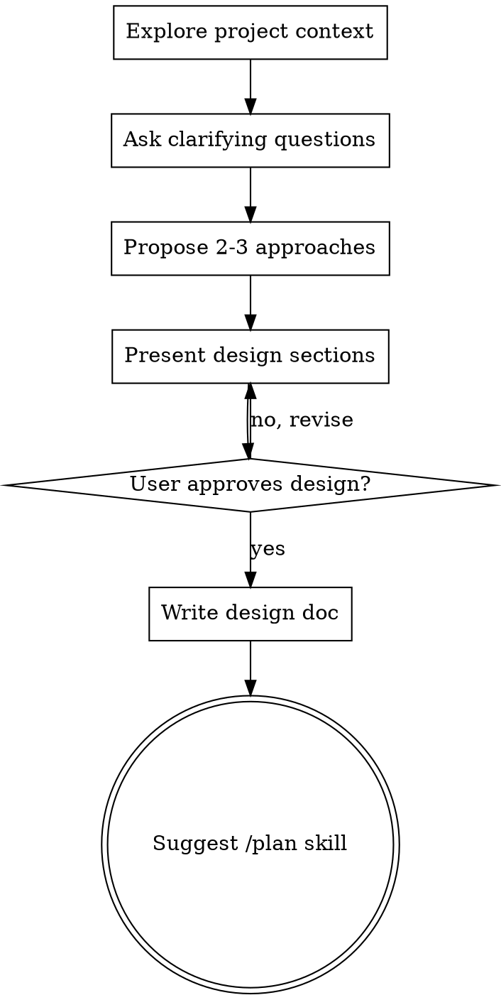

@../_shared/SESSION-TRACKING.md

# /design

## Overview

Help turn ideas into fully formed designs and specs through natural collaborative dialogue.

Start by understanding the current project context, then ask questions one at a time to refine the idea. Once you understand what you're building, present the design and get user approval.

<HARD-GATE>
Do NOT invoke any implementation skill, write any code, scaffold any project, or take any implementation action until you have presented a design and the user has approved it. This applies to EVERY project regardless of perceived simplicity.
</HARD-GATE>

**You MUST NOT call `EnterPlanMode` or `ExitPlanMode` during this skill.** This skill operates in normal mode. Plan mode restricts Write/Edit tools and has no clean exit. Use the /plan skill for structured planning instead.

## Anti-Pattern: "This Is Too Simple To Need A Design"

Every project goes through this process. A todo list, a single-function utility, a config change — all of them. "Simple" projects are where unexamined assumptions cause the most wasted work. The design can be short (a few sentences for truly simple projects), but you MUST present it and get approval.

## Checklist

You MUST create a task for each of these items and complete them in order:

1. **Explore project context** — check files, docs, recent commits
2. **Ask clarifying questions** — one at a time, understand purpose/constraints/success criteria
3. **Propose 2-3 approaches** — with trade-offs and your recommendation
4. **Present design** — in sections scaled to their complexity, get user approval after each section
5. **Write design doc** — save to `.agents/design/YYYY-MM-DD-<topic>.md` and commit
6. **Transition to implementation** — suggest /plan skill to create implementation plan

## Process Flow



**The terminal state is suggesting /plan.** Do NOT invoke any implementation skill. The ONLY next step after /design is /plan.

## The Process

**Understanding the idea:**
- Check out the current project state first (files, docs, recent commits)
- Ask questions one at a time to refine the idea
- Prefer multiple choice questions when possible, but open-ended is fine too
- Only one question per message - if a topic needs more exploration, break it into multiple questions
- Focus on understanding: purpose, constraints, success criteria

**Exploring approaches:**
- Propose 2-3 different approaches with trade-offs
- Present options conversationally with your recommendation and reasoning
- Lead with your recommended option and explain why

**Presenting the design:**
- Once you believe you understand what you're building, present the design
- Scale each section to its complexity: a few sentences if straightforward, up to 200-300 words if nuanced
- Ask after each section whether it looks right so far
- Cover: architecture, components, data flow, error handling, testing
- Be ready to go back and clarify if something doesn't make sense

## After the Design

**Documentation:**
- Write the validated design to `.agents/design/YYYY-MM-DD-<topic>.md`
- Commit the design document to git

**Next Step:**
- Suggest the user run `/plan` to create a detailed implementation plan
- Provide copy-pasteable command for a new session:

```
/plan .agents/design/YYYY-MM-DD-<topic>.md
```

Replace with the actual filename you just created.

## Workflow

Part of: bootstrap → prime → research → **design** → plan → implement → status → verify → release → retro

## Session Status Tracking

**On completion (after writing design doc and committing):**

1. Infer feature name from the design doc filename (e.g., `2026-03-01-session-tracking.md` → `session-tracking`)
2. Get session path using `get_session_path()` with a unique part of your initial arguments
3. Create `.agents/status/YYYY-MM-DD-<feature>.md` with the header template
4. Add entry to "Executed Phases" list
5. Append Design phase section with Summary/Decisions/Issues

## Key Principles

- **One question at a time** - Don't overwhelm with multiple questions
- **Multiple choice preferred** - Easier to answer than open-ended when possible
- **YAGNI ruthlessly** - Remove unnecessary features from all designs
- **Explore alternatives** - Always propose 2-3 approaches before settling
- **Incremental validation** - Present design, get approval before moving on
- **Be flexible** - Go back and clarify when something doesn't make sense

---

## Native Task Integration

**REQUIRED:** Use Claude Code's native task tools (v2.1.16+) to create structured tasks during the design process.

### During Design Validation

After each design section is validated by the user, create a task:

```yaml
TaskCreate:
  subject: "Implement [Component Name]"
  description: |
    [Key requirements from the design section]

    Acceptance Criteria:
    - [ ] [Criterion from design]
    - [ ] [Criterion from design]
  activeForm: "Implementing [Component Name]"
```

Track all task IDs for dependency setup.

### After All Components Validated

Set up dependency relationships:

```yaml
TaskUpdate:
  taskId: [dependent-task-id]
  addBlockedBy: [prerequisite-task-ids]
```

### Before Handoff

Run `TaskList` to display the complete task structure with dependencies.

Include task IDs in the design document for reference.

## Context Report

@../_shared/CONTEXT-REPORT.md
